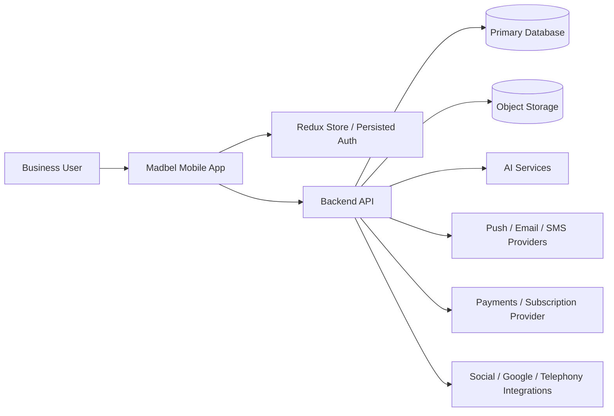
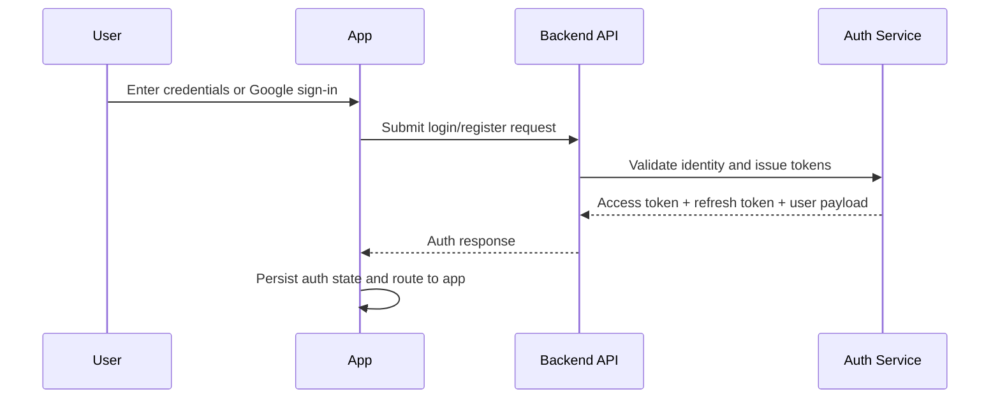
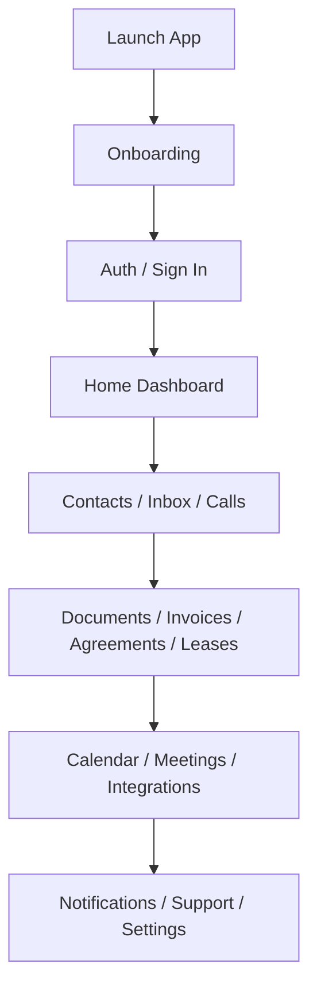
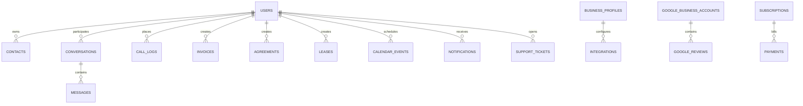
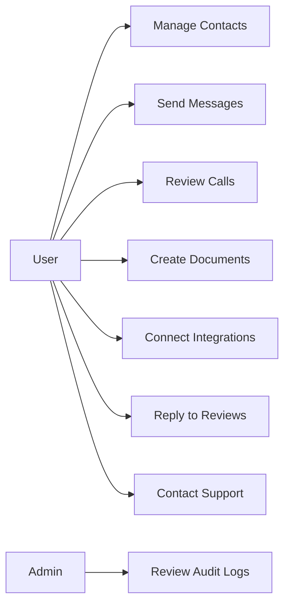
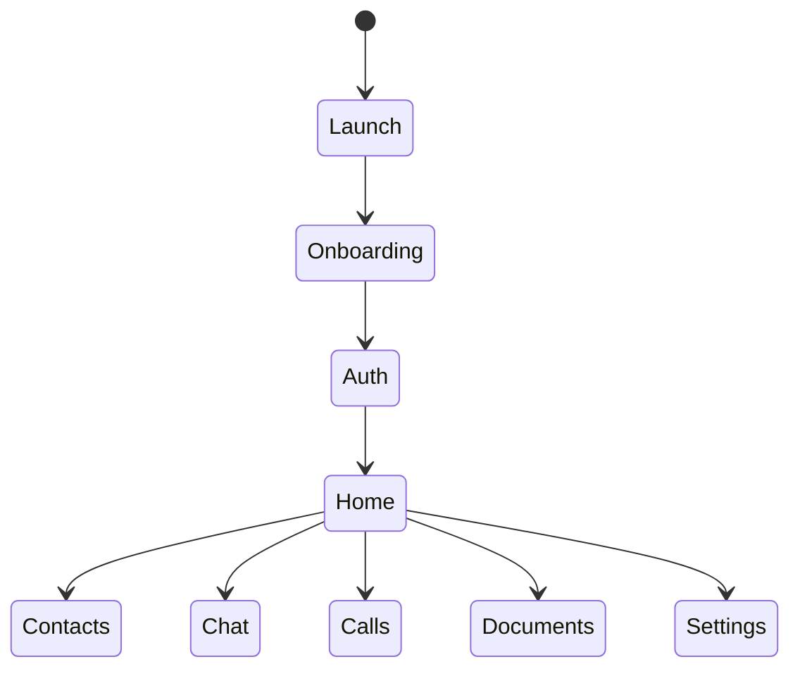

# Madbel Complete Software Requirements Specification (SRS)

## 1. Document Information

| Field | Value |
|---|---|
| Project Name | Madbel |
| Project Type | Mobile App / AI-powered CRM and communications workspace |
| Version | 1.0.0 |
| Prepared By | Codex |
| Date | July 13, 2026 |
| Approval Status | Draft |
| Intended Audience | Product owners, stakeholders, developers, QA engineers, UI/UX designers, support teams, and future maintainers |

### Revision History

| Version | Date | Author | Description |
|---|---|---|---|
| 1.0.0 | July 13, 2026 | Codex | Initial enterprise SRS generated from the current Expo mobile codebase |

### Scope Note

This SRS describes the current Madbel mobile client and a production-ready target platform. The repository is an Expo React Native application with Redux Toolkit, React Navigation, AsyncStorage persistence, Firebase auth dependencies, Google sign-in, speech/audio features, notifications, contacts access, and a large RTK Query API surface. A backend exists as a contract target through `/api/v1/...` endpoints, but not all server-side services are present in this repository. Where backend behavior is not fully visible in code, this document marks the behavior as an assumption.

## 2. Project Overview

### Project Purpose

Madbel is an AI-assisted business communication and operations app that helps users manage contacts, conversations, calls, bulk outreach, calendar events, invoices, agreements, leases, social integrations, Google reviews, support, and subscriptions from a single mobile interface.

### Business Problem

Small teams and independent businesses often juggle separate tools for messaging, calling, customer follow-up, documents, billing, reviews, scheduling, and AI assistance. That creates duplicated effort, inconsistent customer history, and fragmented workflows.

### Solution

Madbel centralizes business communications and operational workflows into one mobile app with:

* Unified inbox and contact management
* AI chat and AI voice workflows
* Calls with summaries, transcripts, recordings, and callbacks
* Calendar and meeting management
* Invoice, agreement, and lease lifecycles
* Bulk messages and group messaging
* Social and Google Business integrations
* Support, settings, subscriptions, and notifications

### Vision

Create a mobile-first workspace where a business team can manage customer communication, documents, follow-up, and AI-assisted workflows without switching between multiple systems.

### Goals

* Reduce time spent switching between communication tools
* Improve response consistency and follow-up discipline
* Provide a searchable operational history for contacts, calls, and documents
* Make AI actions traceable, editable, and safe to review
* Support a scalable foundation for future web and admin experiences

### Objectives

* Enable onboarding, authentication, and session persistence
* Provide a dashboard that summarizes contacts, calls, integrations, and messages
* Support contacts, conversations, and groups
* Support invoices, agreements, leases, and public signing
* Support AI voice and AI chat workflows
* Support notifications, support tickets, subscriptions, and business settings

### Expected Outcomes

* Faster customer response times
* Better organization of customer and business records
* Improved conversion from lead to follow-up to closed transaction
* Better visibility into call and message performance
* Higher adoption of AI-assisted actions because they are embedded in the workflow

### Value to Users

* Users can manage many customer touchpoints in one place
* Teams can coordinate messaging and group collaboration
* Managers can review calls, replies, and documents quickly
* Support and administrative tasks are easier to audit and maintain

### Success Criteria

* New users can onboard and authenticate successfully
* Authenticated users can reach the correct home dashboard and profile areas
* Users can create and manage contacts, conversations, calls, documents, and events
* Users can send or schedule messages and share documents
* The application remains stable on supported iOS and Android devices

## 3. Business Requirements

### Business Goals

* Unify CRM, communications, and document workflows
* Offer an AI-first mobile experience without sacrificing control or traceability
* Provide subscription-ready infrastructure for premium features
* Allow future expansion into a web dashboard and admin console

### Functional Goals

* Authenticate users and persist sessions
* Allow users to manage contacts, threads, and groups
* Support calls, transcripts, summaries, and callbacks
* Support invoices, agreements, leases, and signatures
* Support calendar events, integrations, Google reviews, and notifications
* Support support tickets, settings, and account management

### Operational Goals

* Keep the mobile app responsive and maintainable
* Reduce the risk of data loss with server-side storage and retries
* Use a contract-driven API design so the mobile client can evolve without large rewrites

### User Goals

* Find the right customer or thread quickly
* Take action from the home dashboard without navigating deep menus
* Draft, review, and send business content with confidence
* Monitor important alerts and respond on time

### Business Rules

* Protected data requires authenticated access
* Role and ownership checks must be enforced for every resource
* AI-generated output must be clearly distinguishable from human-authored content
* Public signing must use a time-limited signature token
* Contact, call, and document operations must be auditable

### Constraints

* Current API base URL is configured to an ngrok tunnel in the client
* The current repository is a mobile client, not a full backend
* Some server contracts are inferred from RTK Query endpoint definitions
* Some features are partially implemented in the UI but depend on backend behavior

### Assumptions

* Production will use a secure backend with JWT-based auth and refresh tokens
* Notification delivery will be handled by a push provider and server jobs
* Documents and media will be stored in object storage
* AI features will execute server-side for consistency, traceability, and safety

## 4. System Overview

### High-Level Architecture

Madbel is currently a mobile client that talks to a backend API. The client uses Redux Toolkit Query for network access, Redux Persist for auth state, and Expo services for notifications, speech, audio, contacts, and file handling.



### Frontend

* Expo React Native
* React Navigation for stack and tab routing
* Redux Toolkit and RTK Query for server state
* React Hook Form for forms
* NativeWind and StyleSheet-based UI
* Expo Notifications, Audio, Speech, Contacts, Location, FileSystem

### Backend

* REST API under `/api/v1/...`
* Auth service with login, refresh, OTP, Google sign-in, and logout
* Smartflow service for contacts, conversations, calls, documents, integrations, reports, support, and subscriptions
* Public signing endpoints for leases and agreements

### Database

* Production target: relational database with structured tables and JSON metadata for AI payloads
* Current prototype: session state and selected local app state via AsyncStorage and Redux Persist

### Third-Party Services

* Firebase auth dependencies for some auth flows
* Google Sign-In
* Expo push notifications
* Speech-to-text / voice utilities
* Telephony provider integration, likely Twilio-based from endpoint naming
* Google Business and social platform integrations

### Authentication Flow



### Deployment Architecture

* Mobile app shipped through App Store and Google Play
* Backend hosted in cloud infrastructure behind HTTPS
* Object storage for images, recordings, and PDF exports
* CI/CD for linting, testing, build, and release

## 5. User Roles

### Guest

* Permissions: View onboarding, content pages, and auth screens
* Responsibilities: Create an account or sign in
* Accessible Modules: Onboarding, authentication, content pages
* Restrictions: Cannot access protected business data

### Authenticated User

* Permissions: Access profile, dashboard, messaging, calls, documents, and settings
* Responsibilities: Manage business communication and operational records
* Accessible Modules: Home, contacts, chats, calls, invoices, agreements, leases, calendar, integrations, support, settings
* Restrictions: Access controlled by ownership and role

### Business Owner

* Permissions: Full access to business records, subscription, integrations, reports, and team settings
* Responsibilities: Oversee communications, billing, and operational quality
* Accessible Modules: All user modules plus revenue, subscription, and business profile
* Restrictions: Cannot bypass audit or security checks

### Team Member

* Permissions: Work within assigned conversations, groups, contacts, and documents
* Responsibilities: Respond to customers and execute assigned follow-up tasks
* Accessible Modules: Inbox, contacts, calls, meetings, documents, group chats
* Restrictions: Limited by ownership and sharing rules

### Support Agent

* Permissions: View support tickets, support sessions, and selected account context
* Responsibilities: Troubleshoot issues and assist users
* Accessible Modules: Support queue, ticket details, chat session context
* Restrictions: No unrestricted access to sensitive business data

### Admin

* Permissions: Moderate records, manage reports, review logs, and operate service tools
* Responsibilities: Keep the platform healthy and enforce policy
* Accessible Modules: Admin-style settings, logs, moderation, reporting
* Restrictions: Must follow audit and least-privilege rules

### Super Admin

* Permissions: Full system configuration and oversight
* Responsibilities: Manage users, subscriptions, integrations, and compliance workflows
* Accessible Modules: All admin modules
* Restrictions: Actions are audited

### External Signer

* Permissions: Open public signing links for leases or agreements
* Responsibilities: Review and sign a document
* Accessible Modules: Public signing screen only
* Restrictions: Token-based, time-limited access

## 6. User Journey

### Primary Journey



### Contact and Messaging Journey

1. User opens Home or Contacts.
2. User searches or adds a contact.
3. User opens a conversation or group thread.
4. User sends a message, replies, forwards, archives, or schedules it.
5. User reviews unread summary and delivery state.

### Call Journey

1. User opens Call History.
2. User reviews recent call logs and AI summaries.
3. User opens transcript or summary.
4. User calls back, views recording, or opens analysis.

### Document Journey

1. User opens invoices, agreements, or leases.
2. User creates or edits the record.
3. User shares for signature or sends reminders.
4. User exports or downloads PDF files.
5. User tracks lifecycle and timeline state.

### Meeting Journey

1. User creates a calendar event or meeting.
2. User sets date, location, mode, and attendees.
3. User shares the event.
4. User edits or deletes the meeting later.

### Support Journey

1. User opens support from Profile.
2. User submits a ticket or opens a support session.
3. User exchanges messages with support.
4. User tracks status until resolution.

## 7. Functional Requirements

### Feature Matrix

| ID | Feature | Description | Actors | Priority | Status |
|---|---|---|---|---|---|
| FR-01 | Onboarding | Intro slides, legal pages, and app progress | Guest | High | Current prototype |
| FR-02 | Authentication | Register, login, OTP, forgot password, refresh, logout, Google login | Guest | High | Current prototype |
| FR-03 | App Config and Content | Dynamic app config, about, terms, privacy, help content | Guest | High | Current prototype |
| FR-04 | Home Dashboard | Summary cards, latest activity, contacts, calls, integrations, shortcuts | Authenticated User | High | Current prototype |
| FR-05 | Contacts | List, create, update, delete, avatar upload, search | Authenticated User | High | Current prototype |
| FR-06 | Conversations | Unified inbox, threads, archive, read state, typing state | Authenticated User | High | Current prototype |
| FR-07 | Messages | Send, reply, forward, schedule, unread summaries | Authenticated User | High | Current prototype |
| FR-08 | Group Messaging | Group creation, membership, chat, settings, invites | Authenticated User | High | Current prototype |
| FR-09 | AI Chat and AI Voice | AI text chat, voice chat, transcription, workflow prefill | Authenticated User | High | Current prototype |
| FR-10 | Bulk Messaging | Recipient validation, create, send, cancel, track bulk campaigns | Authenticated User | High | Current prototype |
| FR-11 | Calls | Call history, outbound call, transcript, AI summary, callback, recording | Authenticated User | High | Current prototype |
| FR-12 | Calendar and Meetings | Create, update, delete, share, and sync events | Authenticated User | High | Current prototype |
| FR-13 | Documents | Generic document CRUD and document type utilities | Authenticated User | High | Current prototype |
| FR-14 | Invoices | Create, edit, send, share, remind, PDF export, timeline | Authenticated User | High | Current prototype |
| FR-15 | Agreements | Create, improve, review, send for signature, sign, renew, download PDF | Authenticated User | High | Current prototype |
| FR-16 | Leases | Create, review, enhance terms, sign, renew, download PDF | Authenticated User | High | Current prototype |
| FR-17 | Public Signing | Open signature links for agreement or lease documents | External Signer | High | Current prototype |
| FR-18 | Integrations | Connect, disconnect, sync, and inspect catalog/status for channels | Authenticated User | High | Current prototype |
| FR-19 | Google Reviews | Read accounts, list reviews, reply, delete reply, sync to inbox | Authenticated User | High | Current prototype |
| FR-20 | Notifications | Device token registration and notification inbox management | Authenticated User | High | Current prototype |
| FR-21 | Support | Tickets, support session, support messages | Authenticated User | High | Current prototype |
| FR-22 | Profile and Settings | Profile, avatar, password, notification settings, revoke sessions | Authenticated User | High | Current prototype |
| FR-23 | Subscription | Trial, activate, status, plans, onboarding completion | Authenticated User | Medium | Planned / partial |
| FR-24 | Business Profile | Business metadata and logo upload | Business Owner | Medium | Current prototype |
| FR-25 | Reports | Categories and report generation | Business Owner | Medium | Current prototype |
| FR-26 | Permissions | App-level permission review and acceptance flows | Authenticated User | Medium | Current prototype |
| FR-27 | Shop / Product | Product catalog and product detail browsing | Authenticated User | Low | Compatibility / partial |
| FR-28 | Health Checks | Service readiness endpoints for monitoring | System | Low | Backend utility |

### FR-01 Onboarding

* Description: Present onboarding slides, save progress, and allow skip/complete/reset behavior.
* Actors: Guest
* Preconditions: App is installed and launched.
* Flow: Load slide content, show app value, record progress, route to auth.
* Validation: Slide state and completion state must be persisted.
* Error Cases: Failed load of slide content, unavailable progress state.
* API Required: `/api/v1/onboarding/slides`, `/progress`, `/skip`, `/complete`, `/reset`
* Database Tables: `onboarding_progress`, `app_config`
* Dependencies: App config service, content pages
* Acceptance Criteria: A new user can move from onboarding to auth without confusion.
* Priority: High
* Status: Current prototype

### FR-02 Authentication

* Description: Support register, login, OTP verification, password reset, refresh token, Google login, and logout.
* Actors: Guest
* Preconditions: User has a valid email or provider account.
* Flow: Submit credentials, verify OTP when required, receive tokens, persist auth state.
* Validation: Required fields, OTP length, password policy, email format.
* Error Cases: Invalid credentials, expired OTP, server error, Google auth failure.
* API Required: `/api/v1/auth/*`
* Database Tables: `users`, `sessions`, `refresh_tokens`, `otp_codes`
* Dependencies: JWT service, Google Sign-In, secure token storage
* Acceptance Criteria: Successful auth routes the user into the app and preserves the session on restart.
* Priority: High
* Status: Current prototype

### FR-04 Home Dashboard

* Description: Show a high-signal dashboard with summary cards for calls, messages, contacts, integrations, and documents.
* Actors: Authenticated User
* Preconditions: User is signed in.
* Flow: Load dashboard data, render cards, open deep links to feature screens.
* Validation: Dashboard data must be present or a friendly empty state shown.
* Error Cases: Partial API failure, stale cached data, loading timeout.
* API Required: `/api/v1/smartflow/home`, `/smartflow/contacts`, `/smartflow/calls/summary`, `/smartflow/integrations/status`
* Database Tables: `dashboard_snapshots`, `contacts`, `calls`, `integrations`
* Dependencies: Contacts, calls, integrations, notifications
* Acceptance Criteria: Dashboard displays relevant operational data and actionable shortcuts.
* Priority: High
* Status: Current prototype

### FR-05 Contacts

* Description: Manage contact records with list, search, create, detail, edit, delete, and avatar upload.
* Actors: Authenticated User
* Preconditions: User has contact access.
* Flow: Search contacts, open detail, edit profile, upload avatar, delete when needed.
* Validation: Required name and valid fields, file type checks for avatar upload.
* Error Cases: Duplicate contact, missing record, upload failure.
* API Required: `/api/v1/smartflow/contacts` and avatar endpoint
* Database Tables: `contacts`, `contact_avatars`
* Dependencies: File upload system, permissions
* Acceptance Criteria: Contact records persist and can be searched by name or metadata.
* Priority: High
* Status: Current prototype

### FR-06 Conversations

* Description: Provide a unified inbox with archive, unread counts, typing status, and group/direct threading.
* Actors: Authenticated User
* Preconditions: User has at least one conversation or access to the inbox.
* Flow: Browse threads, open a chat, archive or mark read, return to inbox state.
* Validation: Thread ownership or membership must be verified.
* Error Cases: Empty inbox, deleted thread, unauthorized thread access.
* API Required: `/api/v1/smartflow/conversations/*`
* Database Tables: `conversations`, `conversation_members`, `thread_states`
* Dependencies: Messaging service, notifications
* Acceptance Criteria: User can open a thread and continue the conversation without losing context.
* Priority: High
* Status: Current prototype

### FR-07 Messages

* Description: Send, reply, forward, schedule, and track direct and threaded messages.
* Actors: Authenticated User
* Preconditions: A thread exists.
* Flow: Compose message, send immediately or schedule, track unread and delivery state.
* Validation: Message body length, recipient access, schedule time in the future.
* Error Cases: Delivery failure, canceled schedule, permission revoked.
* API Required: `/api/v1/smartflow/messages/*`
* Database Tables: `messages`, `message_recipients`, `scheduled_jobs`
* Dependencies: Job queue, timezone handling, notification service
* Acceptance Criteria: Message state is visible and recoverable after app restart.
* Priority: High
* Status: Current prototype

### FR-09 AI Chat and AI Voice

* Description: Allow users to chat with AI, send voice input, transcribe speech, and prefill workflows from AI output.
* Actors: Authenticated User
* Preconditions: AI service is available and user has access.
* Flow: Capture text or speech, send to AI endpoint, render response, optionally prefill a form or route.
* Validation: Response schema, length, safe content checks, fallback on malformed output.
* Error Cases: AI timeout, transcribe failure, invalid response format.
* API Required: `/api/v1/smartflow/ai/chat`, `/ai/voice-chat`, `/ai/workflow-prefill`, `/voice/transcribe`
* Database Tables: `ai_history`, `ai_voices`, `ai_extractions`
* Dependencies: AI service, speech service, parser/formatter
* Acceptance Criteria: The app can present AI results and let the user continue manually when needed.
* Priority: High
* Status: Current prototype

### FR-11 Calls

* Description: Manage incoming/outgoing calls, callback actions, recordings, transcripts, and AI summaries.
* Actors: Authenticated User
* Preconditions: Telephony integration is active.
* Flow: Review call logs, open analysis, callback a contact, access transcript and summary.
* Validation: Caller identity and call ownership must be checked.
* Error Cases: Missing recording, failed callback, unavailable transcript.
* API Required: `/api/v1/smartflow/calls/*`, `/api/v1/calls/*`, Twilio endpoints
* Database Tables: `call_logs`, `call_transcripts`, `call_summaries`, `call_recordings`
* Dependencies: Telephony provider, notification triggers
* Acceptance Criteria: Calls can be reviewed and acted on from the app.
* Priority: High
* Status: Current prototype

### FR-14 Invoices

* Description: Create, edit, share, send reminders, change status, and export invoice PDFs.
* Actors: Authenticated User
* Preconditions: User can access invoicing features.
* Flow: Create invoice, manage items and totals, send or share, track timeline.
* Validation: Client, amount, due date, currency, line item totals.
* Error Cases: Missing line items, invalid totals, PDF generation failure.
* API Required: `/api/v1/invoices/*`
* Database Tables: `invoices`, `invoice_items`, `invoice_timeline`
* Dependencies: PDF generator, email delivery, payment integration if enabled
* Acceptance Criteria: Invoice lifecycle is traceable from draft to sent to paid or overdue.
* Priority: High
* Status: Current prototype

### FR-15 Agreements

* Description: Draft, review, improve, sign, renew, send for signature, and download agreements.
* Actors: Authenticated User, External Signer
* Preconditions: Agreement record exists.
* Flow: Create or edit agreement, send for signature, monitor status, sign via token link.
* Validation: Signature token, agreement status, recipient details.
* Error Cases: Expired token, duplicate send, invalid sign request.
* API Required: `/api/v1/smartflow/agreements/*`
* Database Tables: `agreements`, `agreement_documents`, `signature_requests`
* Dependencies: Public signing route, PDF service, audit logs
* Acceptance Criteria: An agreement can be managed end-to-end from draft through signature.
* Priority: High
* Status: Current prototype

### FR-16 Leases

* Description: Manage lease records, enhance terms, review, sign, renew, and export lease PDFs.
* Actors: Authenticated User, External Signer
* Preconditions: Lease record exists.
* Flow: Create lease, review terms, send for signature, sign publicly or in-app, renew later.
* Validation: Lease parties, dates, rent terms, signature token.
* Error Cases: Invalid dates, expired signing token, PDF failure.
* API Required: `/api/v1/smartflow/leases/*`
* Database Tables: `leases`, `lease_documents`, `signature_requests`
* Dependencies: Public signing flow, PDF generator
* Acceptance Criteria: Lease documents can be generated, signed, and downloaded reliably.
* Priority: High
* Status: Current prototype

### FR-18 Integrations

* Description: Connect, disconnect, sync, and monitor external integrations such as WhatsApp, Instagram, Facebook Messenger, LinkedIn, Telegram, and Google Business.
* Actors: Authenticated User
* Preconditions: Integration catalog is available.
* Flow: Select platform, authorize or manually connect, confirm status, sync data.
* Validation: Platform-specific auth mode and account details.
* Error Cases: OAuth failure, manual connection validation failure, unsupported platform.
* API Required: `/api/v1/smartflow/integrations/*`
* Database Tables: `integrations`, `integration_accounts`, `integration_jobs`
* Dependencies: OAuth, platform APIs, webhook verification
* Acceptance Criteria: Connected services appear in status and can be synchronized.
* Priority: High
* Status: Current prototype

### FR-19 Google Reviews

* Description: List Google Business accounts, open reviews, reply or delete replies, and sync reviews into the inbox.
* Actors: Authenticated User
* Preconditions: Google Business account is connected.
* Flow: Select account and location, fetch reviews, respond, sync to inbox.
* Validation: Selected account and location required.
* Error Cases: Missing account, reply failure, sync failure.
* API Required: `/api/v1/smartflow/integrations/google_business/*`
* Database Tables: `google_business_accounts`, `google_reviews`, `review_replies`
* Dependencies: Google Business integration, notifications/inbox sync
* Acceptance Criteria: User can manage review responses in the app.
* Priority: High
* Status: Current prototype

### FR-20 Notifications

* Description: Register push tokens, show notification inbox items, mark read, and dispatch pending notifications.
* Actors: Authenticated User
* Preconditions: Notification permission granted where needed.
* Flow: Register token after login, list notification items, act on messages.
* Validation: Token format, device ID, permission state.
* Error Cases: Token registration failure, provider delivery failure.
* API Required: `/api/v1/smartflow/devices/push-token`, `/notifications/*`
* Database Tables: `notifications`, `device_tokens`, `notification_preferences`
* Dependencies: Expo Notifications, push provider
* Acceptance Criteria: Token registration and notification inbox management work without manual setup.
* Priority: High
* Status: Current prototype

### FR-21 Support

* Description: Open support tickets, start support sessions, and exchange support messages.
* Actors: Authenticated User, Support Agent
* Preconditions: User is signed in.
* Flow: Create a ticket or session, message support, monitor updates.
* Validation: Subject and message body are required.
* Error Cases: Session failure, empty submission, unreadable payload.
* API Required: `/api/v1/smartflow/support/*`
* Database Tables: `support_tickets`, `support_sessions`, `support_messages`
* Dependencies: Help desk workflow, notifications
* Acceptance Criteria: Users can request support without leaving the app.
* Priority: High
* Status: Current prototype

### FR-22 Profile and Settings

* Description: Manage account profile, avatar, language, notification settings, password, and session revocation.
* Actors: Authenticated User
* Preconditions: User is authenticated.
* Flow: Open profile, update details, adjust settings, log out if needed.
* Validation: Password policy, avatar file type, language values.
* Error Cases: Save failure, invalid current password, permission denial.
* API Required: `/api/v1/smartflow/account`, `/settings/*`, `/settings/change-password`, `/settings/revoke-sessions`
* Database Tables: `user_profiles`, `user_settings`, `security_events`
* Dependencies: Auth service, upload service
* Acceptance Criteria: Profile and account updates persist and affect app behavior.
* Priority: High
* Status: Current prototype

### FR-23 Subscription

* Description: Support trials, plan activation, current subscription status, and onboarding completion tracking.
* Actors: Authenticated User, Business Owner
* Preconditions: Billing configuration is available.
* Flow: View plans, begin trial, activate plan, track current status.
* Validation: Payment and entitlement checks.
* Error Cases: Payment failure, expired trial, invalid plan selection.
* API Required: `/api/v1/subscription/*`, `/api/v1/smartflow/subscription/*`
* Database Tables: `plans`, `subscriptions`, `billing_events`
* Dependencies: Payment provider
* Acceptance Criteria: Subscription state is visible and actionable.
* Priority: Medium
* Status: Planned / partial

### FR-25 Reports

* Description: Provide report categories and AI/business report generation.
* Actors: Business Owner, Admin
* Preconditions: Reporting feature is enabled.
* Flow: Choose report category, generate report, review result, export if supported.
* Validation: Report type and permission checks.
* Error Cases: No data, generation timeout, invalid category.
* API Required: `/api/v1/smartflow/reports/*`
* Database Tables: `reports`, `report_categories`, `report_runs`
* Dependencies: Analytics and AI services
* Acceptance Criteria: Reports can be generated from app data and viewed later.
* Priority: Medium
* Status: Current prototype

### FR-26 Permissions

* Description: Review and accept app permissions that are needed for voice, contacts, location, or notifications.
* Actors: Guest, Authenticated User
* Preconditions: The app requests the relevant OS permission.
* Flow: Show rationale, request permission, persist acceptance or rejection.
* Validation: Permission state must be respected.
* Error Cases: Denied or blocked permission, retry prompt unavailable.
* API Required: `/api/v1/app/permissions`
* Database Tables: `permission_states`
* Dependencies: OS permissions
* Acceptance Criteria: The app explains why a permission is needed and behaves safely when denied.
* Priority: Medium
* Status: Current prototype

### FR-27 Shop / Product

* Description: Display product catalog data and product detail views where enabled.
* Actors: Authenticated User
* Preconditions: Shop data is available.
* Flow: Browse products, open details, act on available purchase or info actions.
* Validation: Catalog item integrity.
* Error Cases: Empty catalog, unavailable product.
* API Required: `/api/v1/shop/products/*`
* Database Tables: `products`, `product_views`
* Dependencies: Commerce service
* Acceptance Criteria: Product data renders without blocking other workflows.
* Priority: Low
* Status: Compatibility / partial

### Remaining Functional Details

| ID | Description | Actors | Preconditions | Flow | Validation | Error Cases | API Required | Database Tables | Dependencies | Acceptance Criteria | Priority | Status |
|---|---|---|---|---|---|---|---|---|---|---|---|---|
| FR-03 | Load app config and legal/help content used by onboarding and profile pages | Guest | App is launched | Fetch config, load content page, render static copy | Slug and config payload must exist | Content unavailable, stale content | `/api/v1/app/config`, `/api/v1/content/*`, `/api/v1/onboarding/*` | `app_config`, `content_pages` | CMS, onboarding state | App content loads consistently and can be updated without shipping a new binary | High | Current prototype |
| FR-08 | Manage group creation, membership, invites, and group chat settings | Authenticated User | Thread or group access | Create group, add members, open chat, change settings | Membership and role checks | Invite failure, access denied, missing group | `/api/v1/smartflow/groups/*` | `groups`, `group_members`, `group_invites` | Messaging, notifications | Group collaboration works with proper role checks | High | Current prototype |
| FR-10 | Validate recipients and send scheduled or immediate bulk campaigns | Authenticated User | Contacts exist | Build recipient set, validate, send or cancel campaign | Recipient count, channel, schedule | Partial validation failure, queue failure | `/api/v1/smartflow/bulk-messages/*` | `bulk_messages`, `bulk_message_recipients` | Contacts, job queue, notifications | Bulk campaigns can be created and tracked reliably | High | Current prototype |
| FR-12 | Create and manage calendar events and meeting records | Authenticated User | Calendar access | Create event, edit details, share link, view details | Date/time and attendee integrity | Invalid schedule, share failure, delete failure | `/api/v1/smartflow/calendar/events/*` | `calendar_events`, `calendar_attendees`, `share_links` | Calendar sync, notifications | Users can schedule and share meetings from the app | High | Current prototype |
| FR-13 | Manage generic documents and document type utilities | Authenticated User | Document access | Create or edit a document, fetch type metadata | Document schema and ownership | Missing type, save failure, access denied | `/api/v1/smartflow/documents/*`, `/api/documents/types` | `documents`, `document_types` | PDF/export service | Document records persist and can be opened later | High | Current prototype |
| FR-17 | Open a document from a public tokenized signing URL | External Signer | Valid signature token | Open link, review details, sign document | Token validity and expiration | Expired token, invalid token, duplicate signature | `/api/v1/smartflow/leases/signing/{signature_token}`, `/api/v1/smartflow/agreements/signing/{signature_token}` | `signature_requests`, `signature_events` | Token service, audit logging | External signer can complete signing without a normal app login | High | Current prototype |
| FR-24 | Maintain business profile metadata and upload business logo | Business Owner | Business profile enabled | Edit company details, upload logo, save changes | File type, business name, required fields | Upload failure, validation failure | `/api/v1/smartflow/business-profile/*` | `business_profiles`, `business_assets` | Object storage, upload validation | Business profile data is visible in settings and dashboards | Medium | Current prototype |
| FR-26 | Request and persist OS-level permissions needed by the app | Guest, Authenticated User | Device permission prompt available | Show rationale, request permission, save state | Permission state must be respected | Denied, blocked, unavailable prompt | `/api/v1/app/permissions` | `permission_states` | OS dialogs, notification and contact APIs | App degrades safely when a permission is denied | Medium | Current prototype |

## 8. Module Breakdown

### 8.1 Onboarding Module

* Purpose: Introduce the app and collect early progress state.
* Features: Slides, progress persistence, skip/complete/reset
* Screens: OnboardingScreen
* Backend APIs: Onboarding and app config endpoints
* Database: onboarding progress and app config
* Relationships: Feeds into auth
* Validation: Completion state and content integrity
* Business Logic: First-run experience only
* Permissions: Guest

### 8.2 Authentication Module

* Purpose: Create and manage user sessions.
* Features: Register, login, OTP, forgot/reset password, refresh, Google login, logout
* Screens: Login, Register, VerifyCode, ForgotPassword, ForgotPasswordVerifyCode, NewPassword, NewPasswordSuccess, AccountSuccess
* Backend APIs: `/api/v1/auth/*`
* Database: users, sessions, tokens, OTP
* Relationships: Sets the authenticated context for every other module
* Validation: Email, password, OTP, provider tokens
* Business Logic: Secure token storage and session persistence
* Permissions: Guest

### 8.3 Home Module

* Purpose: Surface the most important operational signals.
* Features: Dashboard cards, recent contacts, calls, integrations, document shortcuts
* Screens: HomeScreen
* Backend APIs: home dashboard, contacts, calls summary, integrations status
* Database: contacts, calls, integrations, dashboard snapshots
* Relationships: Central hub for the whole app
* Validation: Graceful fallback for empty data
* Business Logic: Prioritize actionable items first
* Permissions: Authenticated User

### 8.4 Contacts Module

* Purpose: Manage customer or business contact records.
* Features: List, search, create, update, delete, avatar upload
* Screens: ContactsScreen, AddContactScreen
* Backend APIs: contacts endpoints
* Database: contacts, avatars
* Relationships: Drives conversations, calls, bulk messages, invoices, and groups
* Validation: Required name and contact integrity
* Business Logic: Contacts are the source of truth for outreach
* Permissions: Authenticated User

### 8.5 Messaging Module

* Purpose: Provide direct, group, and bulk messaging.
* Features: Inbox, threads, archive, read state, group chat, bulk message scheduling
* Screens: AllChatScreen, SingleChatScreen, GroupChatScreen, GroupSettingScreen, UnifiedConversationsScreen, BulkMessagingScreen, BulkEmailRecipientsScreen
* Backend APIs: conversations, messages, bulk messages, groups
* Database: conversations, messages, recipients, groups
* Relationships: Integrates with contacts, notifications, and AI
* Validation: Thread membership and schedule rules
* Business Logic: Preserve unread and typing state
* Permissions: Authenticated User

### 8.6 AI Module

* Purpose: Assist with text, voice, image generation, and workflow prefill.
* Features: AI chat, AI voice chat, transcription, voice history, workflow prefill, replay history
* Screens: MicListeningScreen, MicConversationScreen, ProfileVoiceHistoryScreen
* Backend APIs: AI and voice endpoints
* Database: AI history and extraction logs
* Relationships: Can feed contacts, messages, and documents
* Validation: Structured output and confidence thresholds
* Business Logic: AI output is editable and never final by default
* Permissions: Authenticated User

### 8.7 Calls Module

* Purpose: Manage phone communication and call analytics.
* Features: Call history, outbound calls, transcript, summary, callback, recording access
* Screens: CallHistoryScreen, CallAnalysisScreen, ActiveCallScreen, IncomingCallScreen, AiCallScreen
* Backend APIs: call endpoints and Twilio utility endpoints
* Database: call logs, transcripts, recordings, summaries
* Relationships: Connected to contacts and notifications
* Validation: Caller identity and call action authorization
* Business Logic: Callback and AI summary are optional per call
* Permissions: Authenticated User

### 8.8 Documents Module

* Purpose: Create and manage legal and business documents.
* Features: Documents, invoices, agreements, leases, PDF exports, public signing
* Screens: InvoiceListScreen, CreateInvoiceScreen, InvoiceDetailsScreen, InvoiceViewScreen, AgreementListScreen, AgreementCreateScreen, AgreementPreviewScreen, LeaseListScreen, NewLeaseScreen, LeasePreviewScreen, PublicSigningScreen
* Backend APIs: invoice, agreement, lease, document, signature endpoints
* Database: documents, document exports, invoices, agreements, leases
* Relationships: Integrates with contacts, email, calendar, and signing
* Validation: Totals, dates, signature tokens, file availability
* Business Logic: Record lifecycle and audit trail are required
* Permissions: Authenticated User and External Signer

### 8.9 Calendar and Meetings Module

* Purpose: Create, manage, and share events and meetings.
* Features: Calendar event CRUD, share links, Google Calendar sync references
* Screens: ScheduleMeetingScreen, CreateMeetingScheduleScreen, MeetingDetailsScreen
* Backend APIs: calendar event endpoints
* Database: calendar events, share links, attendees
* Relationships: Integrates with contacts and notifications
* Validation: Date/time, location, online meeting link
* Business Logic: Share links should be time-safe and revocable
* Permissions: Authenticated User

### 8.10 Integrations and Reviews Module

* Purpose: Connect external channels and handle Google Business reviews.
* Features: Integration catalog, OAuth start/callback, manual WhatsApp connect, review reply/delete/sync
* Screens: SocialIntegrationsScreen, GoogleReviewsScreen
* Backend APIs: integrations and Google Business endpoints
* Database: integrations, review records, sync jobs
* Relationships: Feeds inbox, contacts, and analytics
* Validation: Platform-specific credential and token rules
* Business Logic: Some platforms require manual or web-only setup
* Permissions: Authenticated User

### 8.11 Profile, Settings, and Support Module

* Purpose: Manage account data, preferences, and support interactions.
* Features: Profile edit, password change, notification settings, account settings, support sessions, logout
* Screens: ProfileHomeScreen, ProfileEditScreen, ProfileChangePasswordScreen, ProfileTermsScreen, ProfilePrivacyScreen, ProfileAboutScreen, ProfileAccountSettingsScreen, ProfileNotificationScreen, ProfileBusinessScreen, ProfileBusinessEditScreen, ProfileSupportScreen, ProfileSubscriptionScreen
* Backend APIs: account, settings, support, subscription, business profile endpoints
* Database: profile, settings, support tickets
* Relationships: Shared across the app
* Validation: Security-sensitive changes require re-authentication
* Business Logic: Persist settings and apply them to delivery behavior
* Permissions: Authenticated User

### 8.12 Shared UI Module

* Purpose: Provide reusable cards, inputs, modal sheets, and layout primitives.
* Features: Form wrappers, confirmation modals, time inputs, upload components, cards
* Screens: Shared components only
* Backend APIs: None
* Database: None
* Relationships: Used by most screens
* Validation: Component-specific
* Business Logic: Keep design consistent and responsive
* Permissions: N/A

## 9. Screen Documentation

### Screen Inventory

| Screen | Purpose | Components | Primary Actions | State Notes |
|---|---|---|---|---|
| BeginScreen | Entry gate before onboarding/auth | Intro CTA, background, branding | Start onboarding, go to login | Guest only |
| OnboardingScreen | Show onboarding slides and consent | Slides, progress, consent controls | Continue, skip, complete | Requires persisted progress |
| LoginScreen | Authenticate user | Email, password, social sign-in | Login, forgot password, register | Shows errors inline |
| RegisterScreen | Create account | Name, email, password, role | Submit registration | May trigger OTP |
| VerifyCodeScreen | Verify OTP | OTP input, resend control | Confirm code | Time-bound |
| ForgotPasswordScreen | Start reset flow | Email input | Request reset | Simple form |
| ForgotPasswordVerifyCodeScreen | Confirm reset code | OTP input | Verify code | Resend available |
| NewPasswordScreen | Set new password | Password fields | Save new password | Must validate policy |
| NewPasswordSuccessScreen | Confirm reset success | Success state | Return to login | Terminal state |
| AccountSuccessScreen | Confirm signup success | Success state | Continue into app | Terminal state |
| HomeScreen | Main dashboard | Cards, summaries, shortcuts | Open modules | Loaded from multiple queries |
| ContactsScreen | Browse contacts | Search, list, actions | Open add/edit | Uses pagination/search |
| AddContactScreen | Add or edit contact | Form fields, avatar upload | Save, cancel | Validation-heavy |
| AllChatScreen | Unified inbox | Search, filters, list | Open thread, archive | Unread badge state |
| SingleChatScreen | Direct conversation | Thread, bubbles, composer | Send/reply/forward | Thread-based |
| GroupChatScreen | Group thread | Header, messages, composer | Send, manage group | Membership required |
| GroupSettingScreen | Group settings | Members, roles, controls | Update group | Admin/owner only |
| UnifiedConversationsScreen | Unified conversation view | Thread list, filters | Open conversation | Inbox-centric |
| MicListeningScreen | Voice capture start | Mic controls, prompt state | Start voice input | Permission sensitive |
| MicConversationScreen | AI voice interaction | Voice UI, transcript | Speak, review, submit | AI-assisted |
| CallHistoryScreen | Review call log | Search, call rows, actions | Open analysis, callback | Uses call summary |
| CallAnalysisScreen | Deep call analytics | Transcript, summary, recording | Review details | Often data-heavy |
| ActiveCallScreen | Live call state | Call controls, timer | Hang up, manage call | Real-time |
| IncomingCallScreen | Incoming call response | Answer/decline UI | Accept or reject | Notification-driven |
| AiCallScreen | AI call experience | AI call UI | Proceed through AI flow | Specialized |
| InvoiceListScreen | Browse invoices | Search, status pills | Create/view/delete | Table/list states |
| CreateInvoiceScreen | Create invoice | Form, line items | Save invoice | Validation-heavy |
| InvoiceDetailsScreen | Invoice lifecycle detail | Timeline, actions | Send, share, remind | Status-driven |
| InvoiceViewScreen | Read-only invoice view | Document preview | Download/share | Display focused |
| AgreementListScreen | Browse agreements | Search, list, actions | Create, delete | Signature-centric |
| AgreementCreateScreen | Draft agreements | Form, attachments, terms | Save draft | Draft/review states |
| AgreementPreviewScreen | Preview agreement | PDF/preview, status | Send for signature | Read-only or action-based |
| LeaseListScreen | Browse leases | Search, list, actions | Create, delete | Rent and dates visible |
| NewLeaseScreen | Draft lease | Form and terms | Save lease | Validation-heavy |
| LeasePreviewScreen | Preview lease | Preview, status, download | Send/sign/renew | Document-centric |
| ScheduleMeetingScreen | Meeting list | Calendar and list | Create meeting | Scheduling hub |
| CreateMeetingScheduleScreen | Create or edit meeting | Date/time, link, location | Save meeting | Prefill supported |
| MeetingDetailsScreen | Meeting detail | Detail rows, share, edit | Share, edit, delete | Share link handling |
| SocialIntegrationsScreen | Connect external channels | Catalog, connect controls | OAuth/manual connect, disconnect | Platform-specific |
| GoogleReviewsScreen | Manage Google reviews | Account selector, list, reply modal | Reply, delete reply, sync | Requires selected account/location |
| NotificationsScreen | Notification inbox | List, mark read | Open item | Push + in-app |
| ProfileHomeScreen | Settings landing page | Profile card, menu rows | Edit profile, support, logout | Language picker included |
| ProfileEditScreen | Edit user profile | Inputs, avatar | Save changes | Profile validation |
| ProfileChangePasswordScreen | Update password | Password fields | Save new password | Sensitive action |
| ProfileTermsScreen | Terms page | Content view | Read/close | Informational |
| ProfilePrivacyScreen | Privacy page | Content view | Read/close | Informational |
| ProfileAboutScreen | About page | Brand and info | Read/close | Informational |
| ProfileAccountSettingsScreen | Account settings | Toggles and controls | Update settings | Sensitive settings |
| ProfileNotificationScreen | Notification preferences | Switches, channels | Save preferences | Delivery rules |
| ProfileBusinessScreen | Business profile | Business info card | Edit business profile | Business-only |
| ProfileBusinessEditScreen | Edit business profile | Form and logo upload | Save changes | Upload supported |
| ProfileSupportScreen | Support chat/session | Ticket/session UI | Message support | Assisted support |
| ProfileVoiceHistoryScreen | AI voice history | List and filters | Replay history | AI audit trail |
| ProfileSubscriptionScreen | Subscription status | Plan cards, entitlement info | Upgrade/downgrade | Billing-aware |

### Screen Behavior Requirements

For all screens:

* Show a loading state while data is being fetched
* Show an empty state when no data exists
* Show an error state for failed API or storage access
* Preserve safe-area spacing and responsive layouts
* Support modern iOS and Android viewport behavior

## 10. API Documentation

### API Design Notes

The repository uses RTK Query endpoint definitions to infer the backend contract. The API is REST-like and grouped under `/api/v1/...` with some compatibility endpoints under `/api/...`. Responses may be wrapped in a `data` envelope or return a direct payload; the mobile client already normalizes several response shapes.

### Standard Headers

* `Authorization: Bearer <accessToken>`
* `Content-Type: application/json`
* `x-skip-auth: true` for unauthenticated content and onboarding endpoints

### Authentication APIs

| Method | Endpoint | Purpose |
|---|---|---|
| POST | /api/v1/auth/register | Create account |
| POST | /api/v1/auth/login | Authenticate user |
| POST | /api/v1/auth/send-otp | Send OTP |
| POST | /api/v1/auth/resend-otp | Resend OTP |
| POST | /api/v1/auth/verify-otp | Verify OTP |
| POST | /api/v1/auth/forgot-password | Start reset flow |
| POST | /api/v1/auth/reset-password | Set new password |
| POST | /api/v1/auth/refresh-token | Refresh session |
| POST | /api/v1/auth/google | Google login |
| GET | /api/v1/auth/me | Fetch current user |
| POST | /api/v1/auth/logout | End session |

### Onboarding and Content APIs

| Method | Endpoint | Purpose |
|---|---|---|
| GET | /api/v1/app/config | Fetch app config |
| GET | /api/v1/onboarding/slides | Fetch onboarding slides |
| GET | /api/v1/onboarding/progress | Fetch onboarding progress |
| POST | /api/v1/onboarding/progress | Save onboarding progress |
| POST | /api/v1/onboarding/skip | Skip onboarding |
| POST | /api/v1/onboarding/complete | Mark onboarding complete |
| POST | /api/v1/onboarding/reset | Reset onboarding |
| GET | /api/v1/content/pages/{slug} | Load generic content page |
| GET | /api/v1/content/about-us | About page |
| GET | /api/v1/content/terms-and-conditions | Terms page |
| GET | /api/v1/content/privacy-policy | Privacy page |
| GET | /api/v1/content/help-support | Help/support content |
| POST | /api/v1/ai/command | Run AI command |

### Smartflow Core APIs

| Method | Endpoint | Purpose |
|---|---|---|
| GET | /api/v1/smartflow/home | Dashboard summary |
| GET | /api/v1/smartflow/contacts | List contacts |
| POST | /api/v1/smartflow/contacts | Create contact |
| GET | /api/v1/smartflow/contacts/{contact_id} | Get contact |
| PATCH | /api/v1/smartflow/contacts/{contact_id} | Update contact |
| DELETE | /api/v1/smartflow/contacts/{contact_id} | Delete contact |
| POST | /api/v1/smartflow/contacts/{contact_id}/avatar | Upload contact avatar |
| GET | /api/v1/smartflow/conversations | List conversations |
| POST | /api/v1/smartflow/conversations | Create conversation |
| GET | /api/v1/smartflow/conversations/{conversation_id} | Get conversation |
| PATCH | /api/v1/smartflow/conversations/{conversation_id}/archive | Archive conversation |
| POST | /api/v1/smartflow/conversations/{conversation_id}/mark-read | Mark thread read |
| GET | /api/v1/smartflow/conversations/{conversation_id}/messages | List messages |
| GET | /api/v1/smartflow/messages/unread-summary | Get unread summary |
| GET | /api/v1/smartflow/conversations/{conversation_id}/typing | Get typing state |
| POST | /api/v1/smartflow/conversations/{conversation_id}/typing | Set typing state |
| POST | /api/v1/smartflow/messages | Create message |
| PATCH | /api/v1/smartflow/messages/{message_id} | Update message |
| POST | /api/v1/smartflow/messages/{message_id}/reply | Reply to message |
| POST | /api/v1/smartflow/messages/{message_id}/forward | Forward message |
| POST | /api/v1/smartflow/bulk-messages/recipients/validate | Validate bulk recipients |
| GET | /api/v1/smartflow/bulk-messages | List bulk messages |
| POST | /api/v1/smartflow/bulk-messages | Create bulk message |
| GET | /api/v1/smartflow/bulk-messages/{bulk_message_id} | Get bulk message |
| PATCH | /api/v1/smartflow/bulk-messages/{bulk_message_id} | Update bulk message |
| POST | /api/v1/smartflow/bulk-messages/{bulk_message_id}/send | Send bulk message |
| POST | /api/v1/smartflow/bulk-messages/{bulk_message_id}/cancel | Cancel bulk message |
| POST | /api/v1/smartflow/ai/chat | AI chat |
| POST | /api/v1/smartflow/ai/generate-image | AI image generation |
| GET | /api/v1/smartflow/ai/voices | AI voice catalog |
| GET | /api/v1/smartflow/ai/history | AI history |
| POST | /api/v1/smartflow/ai/history/{history_id}/replay | Replay AI history |
| POST | /api/v1/smartflow/voice/transcribe | Transcribe audio |
| POST | /api/v1/smartflow/ai/voice-chat | AI voice chat |
| POST | /api/v1/smartflow/ai/voice-chat-upload | AI voice upload |
| POST | /api/v1/smartflow/ai/workflow-prefill | AI workflow prefill |

### Calendar, Documents, and Signing APIs

| Method | Endpoint | Purpose |
|---|---|---|
| GET | /api/v1/smartflow/calendar/events | List events |
| POST | /api/v1/smartflow/calendar/events | Create event |
| GET | /api/v1/smartflow/calendar/events/{event_id} | Get event |
| PATCH | /api/v1/smartflow/calendar/events/{event_id} | Update event |
| DELETE | /api/v1/smartflow/calendar/events/{event_id} | Delete event |
| POST | /api/v1/smartflow/calendar/events/{event_id}/share | Generate share link |
| GET | /api/v1/smartflow/documents | List documents |
| POST | /api/v1/smartflow/documents | Create document |
| PATCH | /api/v1/smartflow/documents/{document_id} | Update document |
| DELETE | /api/v1/smartflow/documents/{document_id} | Delete document |
| GET | /api/v1/smartflow/leases/metadata | Lease metadata |
| POST | /api/v1/smartflow/leases/generate | Generate lease draft |
| POST | /api/v1/smartflow/leases/enhance-terms | Improve lease terms |
| POST | /api/v1/smartflow/leases/review | Review lease draft |
| GET | /api/v1/smartflow/leases/signing/{signature_token} | Fetch public lease signing payload |
| POST | /api/v1/smartflow/leases/signing/{signature_token} | Sign lease publicly |
| GET | /api/v1/smartflow/leases | List leases |
| POST | /api/v1/smartflow/leases | Create lease |
| GET | /api/v1/smartflow/leases/{lease_id} | Get lease |
| PATCH | /api/v1/smartflow/leases/{lease_id} | Update lease |
| DELETE | /api/v1/smartflow/leases/{lease_id} | Delete lease |
| POST | /api/v1/smartflow/leases/{lease_id}/review | Review lease |
| POST | /api/v1/smartflow/leases/{lease_id}/enhance-terms | Improve lease terms |
| POST | /api/v1/smartflow/leases/{lease_id}/send-signature | Send lease for signature |
| POST | /api/v1/smartflow/leases/{lease_id}/sign | Sign lease |
| POST | /api/v1/smartflow/leases/{lease_id}/renew | Renew lease |
| GET | /api/v1/smartflow/leases/{lease_id}/pdf | Download lease PDF |
| GET | /api/v1/smartflow/agreements/metadata | Agreement metadata |
| GET | /api/v1/smartflow/agreements/types | Agreement types |
| GET | /api/v1/smartflow/agreements/priorities | Agreement priorities |
| POST | /api/v1/smartflow/agreements/generate | Generate agreement draft |
| POST | /api/v1/smartflow/agreements/improve | Improve agreement draft |
| POST | /api/v1/smartflow/agreements/review | Review agreement draft |
| GET | /api/v1/smartflow/agreements/signing/{signature_token} | Fetch public agreement signing payload |
| POST | /api/v1/smartflow/agreements/signing/{signature_token} | Sign agreement publicly |
| GET | /api/v1/smartflow/agreements | List agreements |
| POST | /api/v1/smartflow/agreements | Create agreement |
| GET | /api/v1/smartflow/agreements/{agreement_id} | Get agreement |
| PATCH | /api/v1/smartflow/agreements/{agreement_id} | Update agreement |
| DELETE | /api/v1/smartflow/agreements/{agreement_id} | Delete agreement |
| POST | /api/v1/smartflow/agreements/{agreement_id}/improve | Improve agreement |
| POST | /api/v1/smartflow/agreements/{agreement_id}/review | Review agreement |
| POST | /api/v1/smartflow/agreements/{agreement_id}/send-signature | Send agreement for signature |
| POST | /api/v1/smartflow/agreements/{agreement_id}/sign | Sign agreement |
| POST | /api/v1/smartflow/agreements/{agreement_id}/renew | Renew agreement |
| GET | /api/v1/smartflow/agreements/{agreement_id}/pdf | Download agreement PDF |

### Calls, Integrations, Notifications, Support, and Profile APIs

| Method | Endpoint | Purpose |
|---|---|---|
| GET | /api/v1/smartflow/calls | List calls |
| POST | /api/v1/smartflow/calls | Create call log |
| POST | /api/v1/smartflow/calls/outbound | Create outbound call |
| GET | /api/v1/smartflow/calls/summary | Call summary |
| GET | /api/v1/smartflow/calls/{call_id} | Get call |
| PATCH | /api/v1/smartflow/calls/{call_id} | Update call |
| GET | /api/v1/smartflow/calls/{call_id}/transcript | Get transcript |
| PATCH | /api/v1/smartflow/calls/{call_id}/transcript | Update transcript |
| GET | /api/v1/smartflow/calls/{call_id}/ai-summary | Get AI summary |
| PATCH | /api/v1/smartflow/calls/{call_id}/ai-summary | Update AI summary |
| POST | /api/v1/smartflow/calls/{call_id}/callback | Request callback |
| GET | /api/v1/smartflow/calls/{call_id}/recording | Get recording |
| PATCH | /api/v1/smartflow/calls/{call_id}/recording | Update recording |
| GET | /api/v1/smartflow/integrations | List integrations |
| POST | /api/v1/smartflow/integrations | Create integration link |
| GET | /api/v1/smartflow/integrations/catalog | List integration catalog |
| GET | /api/v1/smartflow/integrations/status | Integration status |
| POST | /api/v1/smartflow/integrations/{platform}/sync | Sync integration |
| POST | /api/v1/smartflow/integrations/telegram/manual-connect | Manual Telegram connect |
| POST | /api/v1/smartflow/integrations/whatsapp/manual-connect | Manual WhatsApp connect |
| GET | /api/v1/smartflow/integrations/{platform}/oauth/start | Start OAuth |
| GET | /api/v1/smartflow/integrations/{platform}/oauth/callback | OAuth callback |
| DELETE | /api/v1/smartflow/integrations/{platform} | Disconnect integration |
| GET | /api/v1/smartflow/integrations/google_business/accounts | List Google Business accounts |
| GET | /api/v1/smartflow/integrations/google_business/accounts/{account_id}/locations/{location_id}/reviews | List reviews |
| POST | /api/v1/smartflow/integrations/google_business/accounts/{account_id}/locations/{location_id}/reviews/{review_id}/reply | Reply to review |
| DELETE | /api/v1/smartflow/integrations/google_business/accounts/{account_id}/locations/{location_id}/reviews/{review_id}/reply | Delete review reply |
| POST | /api/v1/smartflow/integrations/google_business/accounts/{account_id}/locations/{location_id}/reviews/sync | Sync reviews to inbox |
| GET | /api/v1/smartflow/notifications | List notifications |
| POST | /api/v1/smartflow/notifications/mark-all-read | Mark all read |
| POST | /api/v1/smartflow/notifications/{notification_id}/read | Mark read |
| DELETE | /api/v1/smartflow/notifications/{notification_id} | Delete notification |
| POST | /api/v1/smartflow/notifications/dispatch-pending | Dispatch queued notifications |
| GET | /api/v1/smartflow/groups | List groups |
| POST | /api/v1/smartflow/groups | Create group |
| GET | /api/v1/smartflow/groups/{group_id} | Get group |
| PATCH | /api/v1/smartflow/groups/{group_id} | Update group |
| DELETE | /api/v1/smartflow/groups/{group_id} | Delete group |
| POST | /api/v1/smartflow/groups/{group_id}/members | Add member |
| PATCH | /api/v1/smartflow/groups/{group_id}/members/{member_id} | Update member role |
| DELETE | /api/v1/smartflow/groups/{group_id}/members/{member_id} | Remove member |
| POST | /api/v1/smartflow/groups/{group_id}/invites | Invite member |
| DELETE | /api/v1/smartflow/groups/{group_id}/invites/{invite_id} | Cancel invite |
| POST | /api/v1/smartflow/groups/{group_id}/leave | Leave group |
| GET | /api/v1/smartflow/business-profile | Get business profile |
| PATCH | /api/v1/smartflow/business-profile | Update business profile |
| POST | /api/v1/smartflow/business-profile/logo | Upload logo |
| GET | /api/v1/smartflow/subscription/plans | List plans |
| GET | /api/v1/smartflow/subscription/current | Current subscription |
| GET | /api/v1/smartflow/reports/categories | Report categories |
| POST | /api/v1/smartflow/reports | Create report |
| GET | /api/v1/smartflow/support/tickets | List support tickets |
| POST | /api/v1/smartflow/support/tickets | Create support ticket |
| GET | /api/v1/smartflow/support/session | Get support session |
| POST | /api/v1/smartflow/support/session | Start support session |
| GET | /api/v1/smartflow/support/messages | List support messages |
| POST | /api/v1/smartflow/support/messages | Create support message |
| POST | /api/v1/smartflow/account | Update account |
| GET | /api/v1/smartflow/settings | Get settings |
| PATCH | /api/v1/smartflow/settings | Update settings |
| POST | /api/v1/smartflow/settings/avatar | Upload avatar |
| GET | /api/v1/smartflow/settings/notifications | Get notification settings |
| PATCH | /api/v1/smartflow/settings/notifications | Update notification settings |
| POST | /api/v1/smartflow/devices/push-token | Register push token |
| POST | /api/v1/smartflow/settings/change-password | Change password |
| POST | /api/v1/smartflow/settings/revoke-sessions | Revoke sessions |

### Compatibility and Utility APIs

| Method | Endpoint | Purpose |
|---|---|---|
| GET | /api/inbox | Legacy inbox compatibility |
| GET | /api/contacts | Legacy contacts compatibility |
| GET | /api/calendar/events | Legacy calendar compatibility |
| POST | /api/calendar/connect | Calendar connect |
| GET | /api/integrations | Legacy integrations compatibility |
| POST | /api/integrations/connect | Integrations connect |
| GET | /api/ai-call-analytics | AI call analytics |
| GET | /api/documents/types | Document type catalog |
| POST | /api/calls/{callId}/callback | Call back legacy route |
| GET | /health | Health check |
| GET | /ready | Readiness check |
| GET | /api/v1/smartflow/users/search | User search |
| GET | /api/v1/twilio/status | Twilio status |
| POST | /api/v1/twilio/provision | Twilio provision |
| POST | /api/v1/twilio/release | Twilio release |
| POST | /api/v1/twilio/custom | Twilio custom action |
| GET | /api/v1/smartflow/social-posts | Social posts |
| POST | /api/v1/smartflow/social-posts | Create social post |
| GET | /api/v1/subscription/status | Subscription status |
| POST | /api/v1/subscription/start-trial | Start trial |
| POST | /api/v1/subscription/activate | Activate subscription |
| POST | /api/v1/subscription/complete-onboarding | Complete subscription onboarding |

### Example Request

```http
POST /api/v1/auth/login
Content-Type: application/json

{
  "email": "sarah@example.com",
  "password": "Secret123!"
}
```

### Example Response

```json
{
  "data": {
    "accessToken": "jwt.access.token",
    "refreshToken": "jwt.refresh.token",
    "user": {
      "id": "usr_123",
      "full_name": "Sarah Martinez",
      "role": "BusinessOwner"
    }
  }
}
```

### Common Status Codes

* `200 OK`
* `201 Created`
* `400 Bad Request`
* `401 Unauthorized`
* `403 Forbidden`
* `404 Not Found`
* `409 Conflict`
* `422 Unprocessable Entity`
* `500 Internal Server Error`

## 11. Database Design

### Data Storage Strategy

* Current prototype: Redux Persist plus AsyncStorage for authenticated session state and lightweight local persistence
* Production target: relational database with object storage for media and documents

### ER Diagram



### Core Tables

| Table | Key Fields | Notes |
|---|---|---|
| users | id, full_name, email, phone, role, auth_provider, status | Account identity |
| sessions | id, user_id, refresh_token, expires_at, revoked_at | Session management |
| contacts | id, owner_user_id, name, email, phone, company, avatar_url, notes | Contact records |
| conversations | id, owner_user_id, type, archived, unread_count, last_message_at | Thread records |
| messages | id, conversation_id, sender_user_id, body, scheduled_for, delivered_at, status | Message records |
| message_attachments | id, message_id, file_url, file_type, size_bytes | Media |
| bulk_messages | id, owner_user_id, channel, subject, status, scheduled_for | Bulk outreach |
| call_logs | id, owner_user_id, contact_id, call_sid, call_type, duration, status | Call records |
| call_transcripts | id, call_id, transcript_text, source | Call text |
| call_summaries | id, call_id, summary_text, purpose, confidence | AI call output |
| calendar_events | id, owner_user_id, title, starts_at, ends_at, location, meeting_link | Meetings |
| documents | id, owner_user_id, document_type, title, status, payload_json | Generic docs |
| invoices | id, owner_user_id, client_name, total_amount, currency, status, due_date | Billing |
| invoice_items | id, invoice_id, description, quantity, unit_price, total_price | Line items |
| agreements | id, owner_user_id, title, client_name, status, signature_token, payload_json | Agreements |
| agreement_documents | id, agreement_id, file_url, version, checksum | Agreement files |
| leases | id, owner_user_id, tenant_name, property_address, status, signature_token, payload_json | Leases |
| lease_documents | id, lease_id, file_url, version, checksum | Lease files |
| groups | id, owner_user_id, title, visibility, status | Group threads |
| group_members | id, group_id, user_id, role, status | Group membership |
| integrations | id, owner_user_id, platform, connected, auth_mode, metadata_json | External channels |
| google_business_accounts | id, owner_user_id, account_name, account_id, location_id, metadata_json | Google Business |
| google_reviews | id, account_id, location_id, review_id, rating, comment, reply_json | Review data |
| notifications | id, user_id, type, title, body, read_at, payload_json | Notification inbox |
| support_tickets | id, user_id, category, priority, subject, status | Support intake |
| support_sessions | id, user_id, agent_user_id, status, started_at | Support chat |
| support_messages | id, session_id, sender_user_id, body, attachments_json | Support chat messages |
| business_profiles | id, owner_user_id, name, logo_url, metadata_json | Business profile |
| subscriptions | id, user_id, plan_id, status, renews_at, trial_ends_at | Billing state |
| plans | id, name, price, cadence, limits_json | Plan catalog |
| payments | id, subscription_id, amount, currency, provider_ref, status | Payment history |
| ai_history | id, user_id, command_type, raw_response, parsed_json, status | AI audit trail |
| ai_extractions | id, user_id, template_key, raw_response, parsed_json, status | AI form-fill audit trail |
| audit_logs | id, actor_user_id, action, entity_type, entity_id, metadata_json | Compliance log |

### Sample Records

```json
{
  "id": "contact_101",
  "owner_user_id": "usr_44",
  "name": "Acme Studio",
  "email": "hello@acme.com",
  "phone": "+1-555-123-4567",
  "company": "Acme Studio",
  "notes": "Priority customer"
}
```

```json
{
  "id": "call_202",
  "owner_user_id": "usr_44",
  "contact_id": "contact_101",
  "call_sid": "CAxxxxxxxx",
  "call_type": "outgoing_direct",
  "duration": 142,
  "status": "completed"
}
```

### Normalization Notes

* Core identity, contact, and billing records should be normalized
* AI payloads can be stored in JSON columns for flexibility
* Public signing records must retain immutable audit fields

## 12. Authentication and Authorization

### Registration

* User provides name, email, password, and role where role selection is enabled
* System validates uniqueness and password policy
* Backend issues OTP if the workflow requires verification

### Login

* User submits email and password or Google credentials
* Backend returns access and refresh tokens
* App persists tokens and user context

### Forgot Password

* User requests reset by email
* System sends OTP or reset flow data
* User verifies and sets a new password

### OTP

* OTP may be numeric or alphanumeric depending on provider
* OTP must expire after a short window
* Resend limits are enforced

### JWT and Refresh Token

* Access token is used for API authorization
* Refresh token is used to renew the session
* Token rotation is recommended

### Session

* Session persists until logout, expiration, or revocation
* Sensitive settings changes may require re-authentication

### Role Permissions

* Permissions are granted by ownership, membership, and role
* Resource access is deny-by-default
* External signing links are token-based and time-limited

### Security Rules

* Least privilege
* Audit logging for privileged actions
* Revocation on logout and on administrative reset

### Token Expiration

* Access tokens should be short-lived
* Refresh tokens should be longer-lived and revocable

### Social Login

* Google login is supported in the current client
* Apple or other social providers may be added later

## 13. Notification System

### Notification Types

* Push notifications
* In-app notifications
* Email notifications
* SMS notifications where enabled

### Triggers

* New message or thread update
* New call or missed call
* Invoice sent or reminder due
* Agreement or lease signature request
* Review reply or sync event
* Support ticket update

### Scheduling

* Immediate delivery for urgent items
* Scheduled delivery for planned reminders
* Digest mode for lower-priority summaries

### Delivery

* Register the push token after authentication
* Store delivery state in the database
* Surface unread counts and notification inbox items in the UI

### Retry Mechanism

* Retry transient provider failures
* Fail gracefully if the token is invalid or revoked

## 14. Search and Filtering

### Search Logic

* Search contacts, conversations, messages, invoices, agreements, leases, calls, reviews, and groups
* Use indexed fields for high-frequency search targets

### Sorting

* Most recent first by default
* Optional sorting by status, amount, name, or date depending on module

### Filtering

* Unread / archived threads
* Call type and callback state
* Invoice, agreement, and lease status
* Integration platform
* Review account/location

### Pagination

* Cursor pagination preferred for feeds and inboxes
* Page-based pagination is acceptable for admin-style tables

### Caching

* Cache reference data such as onboarding slides, integration catalog, and subscription plans
* Cache recent inbox and summary data where safe

### Optimization

* Use server-side search and pagination
* Avoid downloading large payloads until a detail screen is opened

## 15. File Upload System

### Supported Formats

* Images: JPEG, PNG, HEIC where supported
* Audio: M4A, AAC, MP3
* Video: MP4 and MOV if enabled
* Documents: PDF and other allowed business file formats

### Size Limits

* Enforce per-file and per-request size limits
* Bulk uploads should have explicit count limits

### Storage

* Use object storage with signed upload or download URLs
* Keep only metadata in the database

### Compression

* Compress images before upload when possible
* Prefer thumbnails in list and preview views

### Validation

* Check MIME type, file count, and file size
* Reject corrupted or unsupported content

### Security

* Private buckets with short-lived signed URLs
* Virus scanning where feasible
* Authorization checks on every retrieval

## 16. Payment System

### Current State

Payments are not fully visible in the current mobile client, but the subscription and billing surface indicates a production-ready payment layer is planned.

### Subscription

* Support monthly and annual plans
* Link entitlements to feature access

### One-Time Payment

* May be used for add-ons, document exports, or advanced AI features

### Refund

* Refunds are processed through the payment provider and support workflow

### Webhook

* Payment status should be confirmed by signed webhooks

### Invoice

* Billing records should be persisted separately from app invoices if both exist

### Taxes

* Apply tax rules according to jurisdiction and billing setup

### Receipt

* Send digital receipts after successful charges

### Payment Failure

* Notify the user and allow retry or downgrade flow

### Retry Logic

* Retry failed renewals according to provider policy

## 17. Subscription System

### Plans

| Plan | Benefits | Limits |
|---|---|---|
| Free or Trial | Core communication and limited AI / document usage | Lower limits |
| Pro | Enhanced workflow, AI, and reporting features | Higher limits |
| Business | Team, analytics, and integration controls | Expanded limits |

### Renewal

* Auto-renew by default unless canceled
* Notify before renewal when required

### Cancellation

* Cancellation should keep access until the current period ends

### Grace Period

* A short grace period may apply for failed charges

### Upgrade and Downgrade

* Pro-rate when required by billing policy
* Apply changes immediately or at renewal based on plan rules

## 18. Analytics and Reports

### Dashboard

* Call totals and minutes saved
* Recent contacts and messages
* Integration connection health
* Revenue or invoice summaries

### Charts

* Call volume over time
* Response time trends
* Review response activity
* Message delivery and bulk campaign performance

### Statistics

* Unread count
* Call counts
* Average call duration
* Open invoices
* Pending signatures

### Reports

* AI call summaries
* Business reports
* Contact engagement reports
* Invoice and document lifecycle reports

### Export

* PDF export for documents and reports
* CSV export where operationally useful

### KPIs

* First response time
* Call callback rate
* Message delivery rate
* Review response rate
* Signature completion rate

## 19. Admin Panel

### Dashboard

* Total users
* Total contacts
* Total calls
* Document volume
* Subscription totals

### User Management

* Search users
* Suspend or restore accounts
* Reset roles and permissions

### Content Management

* Manage onboarding and content pages
* Moderate generated summaries where required

### Reports

* Generate operational and support reports

### Subscriptions

* View plan assignments and entitlement state

### Revenue

* Track subscription and invoice revenue

### Notifications

* Broadcast announcements and service notices

### Settings

* Configure system-wide limits and feature flags

### Moderation

* Review flagged records or abuse reports

### Audit Logs

* Track actor, action, entity, and timestamp for privileged changes

## 20. Security Requirements

* Enforce authentication for protected endpoints
* Authorize every resource by role, ownership, or membership
* Use HTTPS for all production traffic
* Encrypt sensitive data at rest
* Rate limit login, OTP, callback, and upload endpoints
* Validate input on client and server
* Prevent injection with parameterized queries and safe ORM usage
* Prevent XSS through safe rendering and output encoding
* Use CSRF protection if cookie-based auth is introduced
* Mask or avoid storing sensitive data that is not required
* Maintain audit trails for administrative and signing actions
* Use short-lived signed URLs for downloads and public signing
* Follow OWASP Top 10 practices

## 21. Performance Requirements

### Expected Users

* Support a small pilot initially
* Scale to multiple teams and business accounts over time

### Response Time

* Primary screens should render quickly on modern phones
* Normal API responses should be fast enough for interactive use

### Scalability

* Backend services should scale horizontally
* Database access should be indexed and paginated

### Caching

* Cache static content and catalogs
* Avoid reloading the same reference data repeatedly

### Lazy Loading

* Load conversation, call, and document detail data on demand

### Optimization

* Minimize unnecessary re-renders in React Native
* Compress media before upload

### Performance Targets

* Smooth navigation on supported devices
* No blocking synchronous work on the main UI thread

## 22. Error Handling

### Frontend Errors

* Display readable inline or banner errors
* Preserve user input when submission fails

### Backend Errors

* Return consistent error objects with code and message

### API Errors

* Distinguish auth, validation, permission, not found, conflict, and server failures

### Validation Errors

* Highlight the exact field that failed validation

### Network Errors

* Show retry options and offline-safe fallback states where possible

### Retry Logic

* Retry transient actions such as upload, sync, and notification dispatch

### Fallback Behavior

* Show cached or last-known data when safe
* Fall back to manual input when AI or sync logic fails

## 23. Non-Functional Requirements

### Performance

* App interactions must feel responsive

### Scalability

* Architecture must support more users, contacts, calls, and records

### Reliability

* Prevent data loss through durable storage and retries

### Maintainability

* Keep modules separated by feature and purpose

### Availability

* Production services should target high availability

### Accessibility

* Support readable contrast, touch targets, and accessible navigation

### Localization

* All user-facing text should be localizable

### Internationalization

* Date, time, phone number, and currency formatting must be locale-aware

### Compatibility

* Support modern iOS and Android versions

### Usability

* Keep business workflows short and understandable

### SEO

* Not applicable to the mobile client; relevant if a web portal is added later

## 24. Testing Requirements

### Unit Testing

* Test reducers, selectors, validators, formatters, and helper utilities

### Integration Testing

* Test screen-to-screen flows and form submission chains

### API Testing

* Validate contracts, auth, and error handling

### Security Testing

* Check access control, token handling, and public signing boundaries

### Performance Testing

* Validate large lists, uploads, and detail screen loads

### Regression Testing

* Verify auth, contacts, messaging, calls, documents, and settings after each release

### Manual Testing

* Validate navigation, keyboard handling, safe areas, and permission prompts

### Acceptance Testing

* Confirm each major journey works end-to-end

### Edge Cases

* Empty inbox
* Expired OTP
* Denied permissions
* Missing media
* Duplicate contacts
* Expired signing token
* Failed push registration

### Test Scenarios

* Register and log in with email
* Register and log in with Google
* Add a contact and open a conversation
* Send and archive a message thread
* Place a callback from call history
* Create and share an invoice
* Send an agreement for signature
* Open a public signing link
* Connect a social integration
* Reply to a Google review

## 25. Deployment

### Development Environment

* Expo local development with hot reload
* Android emulator, iOS simulator, or device testing

### Staging

* Staging API and staging database
* QA builds with internal testers

### Production

* Signed app store releases
* Production API behind HTTPS and secure infrastructure

### CI/CD

* Install dependencies
* Run lint and tests
* Build mobile artifacts
* Run migrations and deploy backend

### Environment Variables

* API base URL
* Auth and social provider client IDs
* Storage bucket or CDN URLs
* Notification provider credentials
* AI provider keys
* Payment provider secrets

### Secrets

* Store secrets in a managed secret store, not source control

### Monitoring

* Crash reporting
* API latency
* Error rate
* Queue backlog

### Logging

* Structured logs with request IDs and actor IDs

### Crash Reporting

* Capture stack traces and device metadata safely

### Rollback Strategy

* Keep previous app and backend versions available for rollback

## 26. Maintenance Plan

### Monitoring

* Track crashes, service health, and notification queues

### Bug Fixes

* Prioritize auth, messaging, call, and document defects first

### Updates

* Keep dependencies and SDKs updated for security and compatibility

### Versioning

* Use semantic versioning for app and API releases

### Backup

* Backup database, media, and document assets regularly

### Recovery

* Define restore procedures for storage, auth, and metadata

### Support Process

* Triage issues through support tickets and admin tools

## 27. Future Enhancements

* Web dashboard for desktop workflows
* Offline drafting and sync queues
* More advanced AI summarization and routing
* CRM pipeline stages and lead scoring
* Document templates and clause libraries
* Better bulk messaging analytics
* Scheduled campaigns with templates and A/B testing
* Multi-language support
* Richer reporting and export options
* Deeper admin moderation workflows

## 28. Risks

### Technical Risks

* Backend contracts may change while the mobile app is under active development
* AI output may vary in structure and quality
* Upload, sync, and telephony flows are complex to harden

### Business Risks

* Users may expect AI outputs to be authoritative without review
* Subscription value may be unclear if too many features are gated too early

### Security Risks

* Contact, call, or document data exposure
* Improper authorization in shared threads or public signing
* Leaked signed URLs or tokens

### Performance Risks

* Large lists, long threads, and media-heavy records may affect memory or scroll performance
* Network latency can degrade the experience on mobile connections

### Operational Risks

* Push notification failures
* Queue backlogs
* Support volume growth

### Mitigation Strategies

* Enforce least privilege and auditing
* Paginate large data sets
* Compress media and cache carefully
* Add monitoring, retries, and rollback support

## 29. Glossary

| Term | Meaning |
|---|---|
| AI Summary | A generated summary created from calls, messages, or workflows |
| Bulk Message | A message sent to many recipients at once |
| Conversation | A direct or group thread containing messages |
| Contact | A person or business record used for communication |
| Google Business Account | A connected business profile used for reviews |
| JWT | Token used to authorize API requests |
| OTP | One-time passcode used for verification |
| Public Signing | Token-based document signing via a shareable link |
| RTK Query | Redux Toolkit feature used for data fetching and caching |
| AsyncStorage | Local key-value storage used by the prototype |
| Subscription | A paid plan that grants feature access |
| Thread | A conversation or chat session |

## 30. Appendix

### A. Flowcharts

Included in Sections 4 and 6.

### B. Sequence Diagrams

Included in Section 4.

### C. ER Diagram

Included in Section 11.

### D. Use Case Diagram



### E. State Diagram



### F. Wireframe References

* Dashboard cards and summary rows
* Unified inbox and thread views
* Invoice, agreement, and lease list/detail screens
* Meeting scheduling and detail screens
* Profile and support screens

### G. API Collection Summary

* Authentication
* Onboarding and content
* Contacts and inbox
* Messages and groups
* AI chat and voice
* Calls and callback
* Calendar and meetings
* Invoices, agreements, and leases
* Integrations and reviews
* Notifications and support
* Profile, settings, and subscriptions

### H. Folder Structure

```text
src/
  components/
  context/
  formWrapper/
  hooks/
  root/
  redux/
  screens/
  stack/
  utils/
assets/
docs/
```

### I. Coding Standards

* Use functional React components
* Keep screen logic and shared UI separate when complexity grows
* Prefer descriptive names over abbreviations
* Keep API contracts explicit and validated

### J. Naming Conventions

* Screens: PascalCase
* Hooks: `useXxx`
* API hooks: `useMadbelXxx`
* Routes: readable feature names

### K. Project Setup Instructions

* Install dependencies
* Run `npm install`
* Start Expo with `npm start`
* Use `npm run android`, `npm run ios`, or `npm run web`

### L. Build Instructions

* Use Expo platform build commands
* Validate environment variables before release builds

### M. Deployment Instructions

* Build release artifacts in CI
* Deploy backend and database migrations
* Release signed mobile builds through app stores

### N. Environment Variables

* `API_BASE_URL`
* `GOOGLE_CLIENT_ID`
* `STORAGE_BUCKET`
* `NOTIFICATION_KEY`
* `AI_PROVIDER_KEY`
* `PAYMENT_SECRET`

### O. Third-Party Services

* Google Sign-In
* Push notifications
* Object storage
* Telephony provider
* Social integrations
* AI model provider
* Analytics and crash reporting
* Payment processor

### P. External Dependencies

* Expo
* React Native
* React Navigation
* Redux Toolkit
* RTK Query
* React Hook Form
* AsyncStorage
* NativeWind
* Expo Notifications
* Expo Speech / Audio / Contacts / Location

## 31. Open Feature Notes

The current mobile client already exposes a large surface area, but the following items should be treated as high-priority production hardening work:

* Bulk attachment handling at scale
* Scheduled message delivery reliability
* Public signing token expiration handling
* AI response normalization and fallback routing
* Voice transcription error recovery
* Google review sync conflict handling
* Notification token refresh and revocation handling
* Better offline recovery for compose flows
